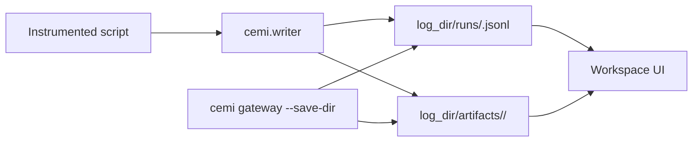
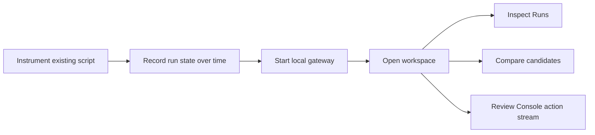

# Capicú Edge ML Inference

Capicú Edge ML Inference (CEMI) is an Edge AI/TinyML experiment workspace for turning run metadata, metrics, artifacts, and explicit action events into a browsable workflow.

At a high level, CEMI provides three main capabilities:

- A **Writer** for recording runs, parameters, metrics, artifacts, and action events from your code
- A **local gateway and CLI** for serving and browsing saved runs without requiring a cloud backend
- A **workspace UI** for exploring runs, comparing candidates, and inspecting a console-style event stream

You can instrument an existing training or evaluation script with a few Writer calls, point CEMI at the same save directory, and inspect the results in the browser.

## Why CEMI

CEMI is designed for local-first experiment inspection and evaluation workflows where you want:

- **Simple run logging**: record parameters, metrics, statuses, notes, and artifacts with a Python Writer
- **Explicit action visibility**: surface chronological action events directly in the Console instead of relying only on inferred telemetry
- **Side-by-side analysis**: compare runs and inspect tradeoffs in a dedicated Compare view
- **Local operation by default**: browse your data on your machine through a local gateway and workspace UI
- **Progressive adoption**: add Writer calls to an existing repo without rebuilding your full training stack around a new platform

## What CEMI Includes

| Component | Description |
| --- | --- |
| `cemi.writer` | Python Writer APIs for runs, parameters, metrics, artifacts, and action events |
| `cemi` CLI | Commands for serving the local gateway, opening the workspace, and launching monitored runs |
| Local gateway | Reads run JSONL and artifacts from disk and serves the workspace UI locally |
| Workspace UI | Workspace, Runs, Compare, and Console views for inspecting recorded activity |

## Installation

### From source

For development or local testing from this repository:

```bash
pip install -e ./cli
```

For CLI development and tests:

```bash
pip install -e "./cli[dev]"
pytest cli/tests/ -q
```

### Frontend development

To run the workspace UI in development mode:

```bash
npm install
npm run dev
```

Then open `http://localhost:3000/login` or `http://localhost:3000/workspace`.

## Quick Start

The canonical local flow is:

1. Install the CLI from this repo with `pip install -e ./cli`
2. Add the Writer to your script with a shared `log_dir`
3. Start the local gateway with the same save directory
4. Open the workspace and inspect the run

### Minimal Writer example

```python
from cemi.writer import create_writer

writer = create_writer(project="default", log_dir=".cemi")
writer.start_run(name="my-run")
writer.log_parameter(key="learning_rate", value=0.001)
writer.log_metric(name="loss", value=0.5, step=1)
writer.emit_run_record()
writer.end_run(status="succeeded")
writer.emit_run_record()
```

### Start the local gateway

```bash
cemi gateway
```

By default, this reads from `.cemi/runs/` and `.cemi/artifacts/` and serves the workspace at:

- `http://127.0.0.1:3141/workspace`

### Open the workspace

```bash
cemi view
```

Or open `http://127.0.0.1:3141/workspace` directly in your browser.

## Local Data Contract

CEMI works best when the Writer and gateway point at the same save directory.

- Writer snapshots are written to `log_dir/runs/<run_id>.jsonl`
- Artifacts are written to `log_dir/artifacts/<run_id>/`
- The gateway reads the same directory via `cemi gateway --save-dir <path>`

If the Writer and gateway do not share the same path, the workspace will not see the expected runs or artifacts.



## Core Workflow



### 1. Instrument an existing script

Add Writer calls to your current training, evaluation, or compression workflow. You do not need to invent a separate training recipe just to use CEMI.

### 2. Record run state over time

Use the Writer to log:

- run lifecycle events
- parameters
- step metrics
- summary metrics
- local file artifacts
- explicit action events

### 3. Browse the run locally

Use the local gateway and workspace to inspect:

- the Runs table
- Compare workflows
- artifact-backed views
- the Console action stream

## Common CLI Commands

```bash
cemi help
cemi config
cemi gateway
cemi gateway --save-dir /path/to/save_dir
cemi view
cemi view --save-dir /path/to/save_dir
cemi start -- python train.py
cemi stop
```

### Command overview

| Command | Purpose |
| --- | --- |
| `cemi gateway` | Start the local gateway and serve the workspace UI |
| `cemi view` | Open the local workspace in the browser |
| `cemi start -- ...` | Launch your command with CEMI local run wiring |
| `cemi stop` | Stop background processes started by local dev flows |

## Monitoring Another Repository

CEMI can monitor a separate training or evaluation repository by adding only Writer calls to that existing codebase.

For example, if you have a separate compression or benchmark project:

- add Writer instrumentation to its existing execution loop
- write runs to a known `log_dir`
- start `cemi gateway --save-dir <same path>`
- open the workspace with `cemi view`

See `cli/README.md` for the detailed monitoring flow and command examples.

## Repository Layout

```text
backend/                 Local storage and API-facing data handling
cli/                     Python CLI, Writer, examples, and tests
docs/                    Project and operational documentation
scripts/                 Helper scripts and demos
src/                     Workspace UI source
src/pages/workspace/     Workspace landing and project selection
src/components/cemi/     Main CEMI layout and feature views
src/pages/compare/       Compare workflow
src/pages/console/       Console action-event stream
```

The public marketing website now lives in a separate repository. This `cemi` repo owns the OSS product surface: Writer, CLI, local gateway, and workspace UI.

## Development

### Verify the Python side

```bash
pip install -e ./cli
pip install -e "./cli[dev]"
pytest cli/tests/ -q
```

### Verify the frontend side

```bash
npm install
npm run build
```

### Local end-to-end check

In one terminal:

```bash
cemi gateway
```

In another terminal:

```bash
python -m cemi.examples.test_writer
```

Then open:

- `http://127.0.0.1:3141/workspace`

You should see the run appear in the workspace.

## Troubleshooting

### No runs appear in the workspace

Make sure:

- the Writer and gateway use the same directory
- the gateway is running before or while you open the workspace

### Artifact loads return 404

If the gateway is running on a non-default port, set:

```bash
export CEMI_LOCAL_SERVER_URL=http://127.0.0.1:<port>
```

so artifact URLs match the gateway serving them.

### Reset a broken local setup

```bash
cemi stop
rm -rf .cemi
rm -rf ~/.cemi
```

Only do this if you no longer need the saved runs, artifacts, config, or PID files.

## Status

CEMI is in early preview.

The local-first Writer + gateway + workspace flow is ready for testing. Cloud and advanced hosted features are still evolving.

## Contributing

Contributions are welcome.

For bug fixes and targeted improvements, open an issue or pull request. For larger changes, new feature areas, or architecture-affecting work, start with a discussion or design note so the work lands cleanly in the core product direction.

As the OSS shape of CEMI matures, this repository will grow a stronger public contribution and governance model.

## Citation

If you use CEMI in research, benchmarks, products, or publications, please cite the software using the metadata in `CITATION.cff`.

If you build on CEMI in a public benchmark, report, paper, blog post, or product documentation, we also appreciate an acknowledgment and link to the project repository:
`https://github.com/capicu-pr/cemi`

## License

See `LICENSE.txt` for licensing terms.
